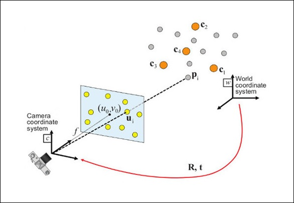
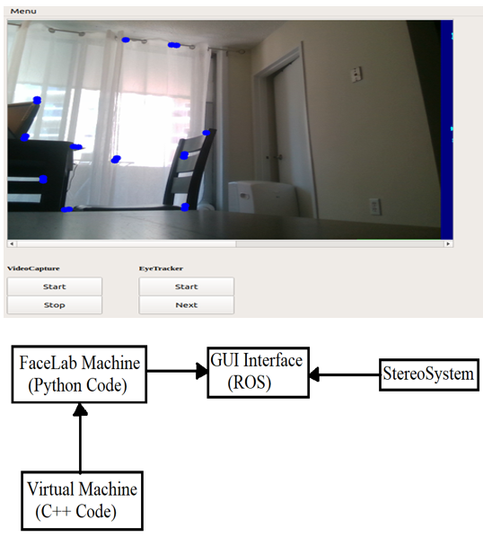
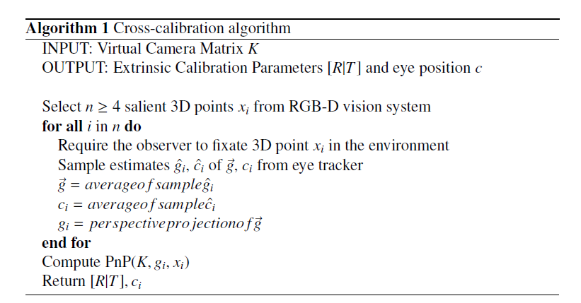

# Calibration EyeTracker & Stereo Camera

Calibrating a camera and eye tracker system involves aligning the data collected by both systems to ensure accurate tracking of eye movements within the camera's field of view. Setup and Configuration process was mounting the camera in a fixed position and setting up the eye tracker system according to the manufacturer's instructions. Then, we display a calibration target on a screen within the camera's field of view. The calibration target typically consists of several points or markers at known locations on the screen. These points will be used as reference points during the calibration process.

The eye Tracking Software, was called Facelab, which had its own machine and was connected with socket to the main machine for receiving data in real-time. This software will guide the participant through the calibration procedure. Then we asked the participant to sit in front of the screen and follow the instructions provided by the eye tracking software. Typically, the participant will be asked to fixate on each calibration point in succession. There was GUI interface was created with PyQt as shown in the image below.

As the participant fixates on each calibration point, both the camera and the eye tracker system will collect data. The camera will capture the participant's gaze direction, while the eye tracker system will record the corresponding eye movements. Then, we finally after collecting the points, we compute translation and rotation using SolvePnP algorithm. Its code is shown below.

